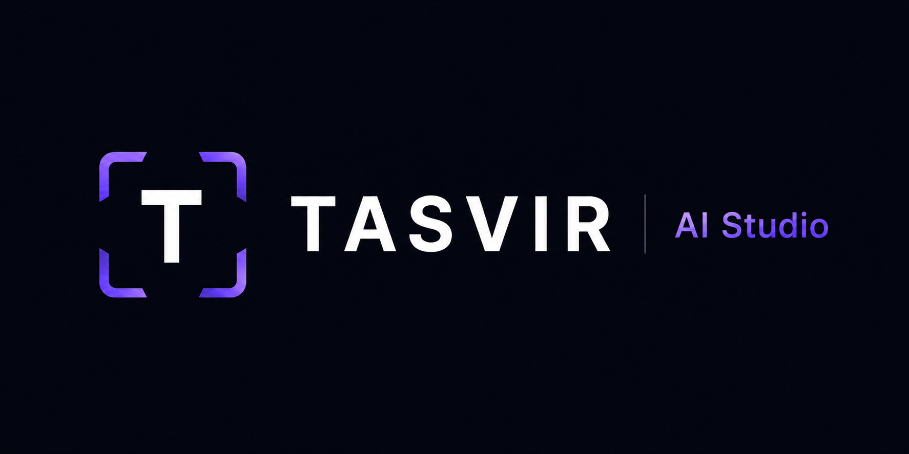

# Tasvir AI Studio

Tasvir is an open-source creative workspace for producing social media content
packages and original visuals from a product, brief, or simple idea.

`Tasvir` is a Turkish word meaning a depiction, representation, or vivid
description of something. The name reflects the project's purpose: turning an
idea, product, or brief into content that can be seen, read, and shared.

The project runs locally. Every user provides their own API keys and keeps
generated files and database records on their own computer.

## Current Features

- Content Studio interface for captions, stories, ad headlines, product copy,
  hashtags, CTA text, and carousel outlines
- Local Content Studio generation through Ollama and Qwen
- Recent content packages with search, copy, TXT download, and PDF export
- Image Studio with Gemini-assisted prompt creation
- Text-to-image generation through Hugging Face
- Categories, projects, favorites, archives, downloads, and deletion
- English and Turkish interface
- Custom dimensions and social media format presets

## Demo

### Screenshots

#### Home

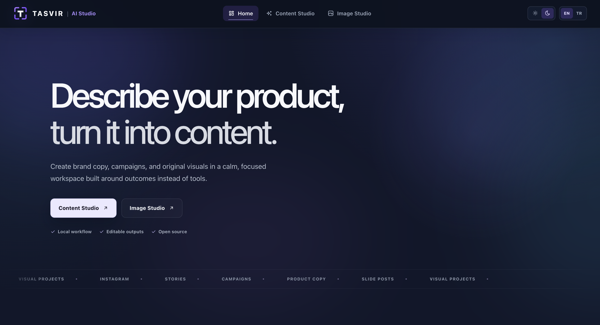

#### Content Studio

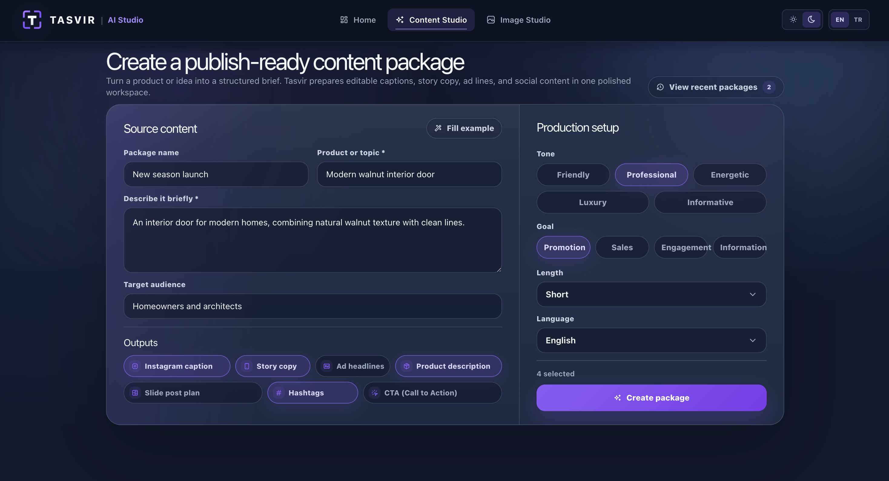

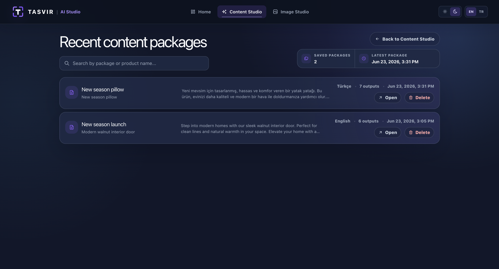

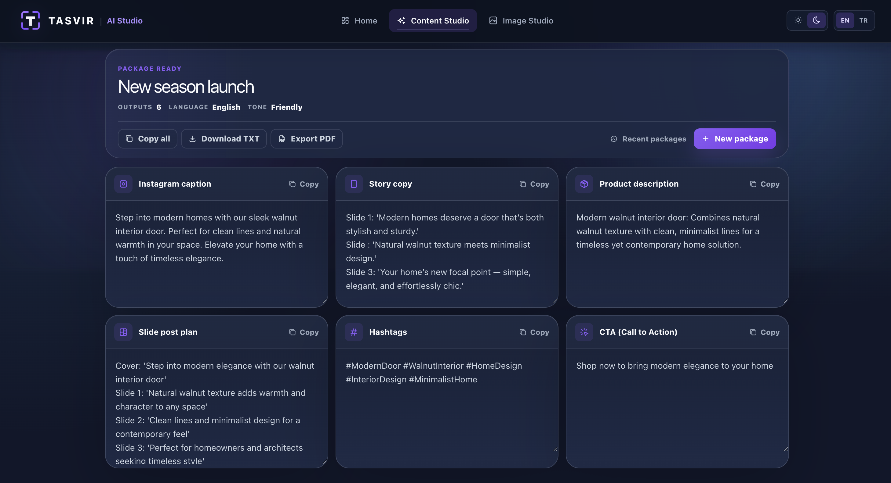

PDF export preview from a generated content package:

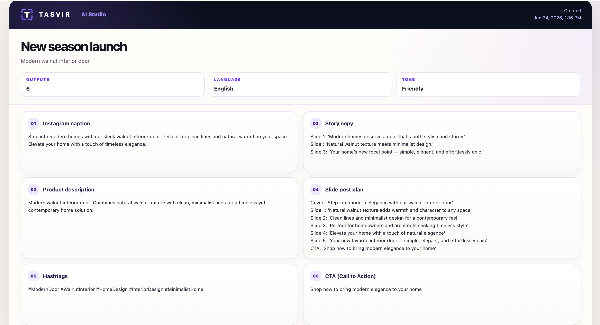

#### Image Studio

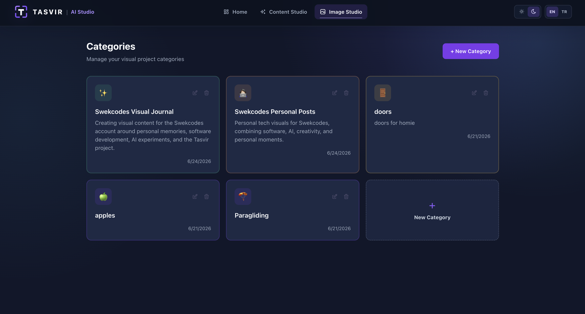

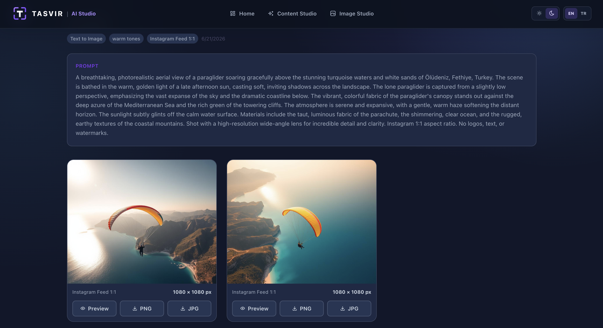

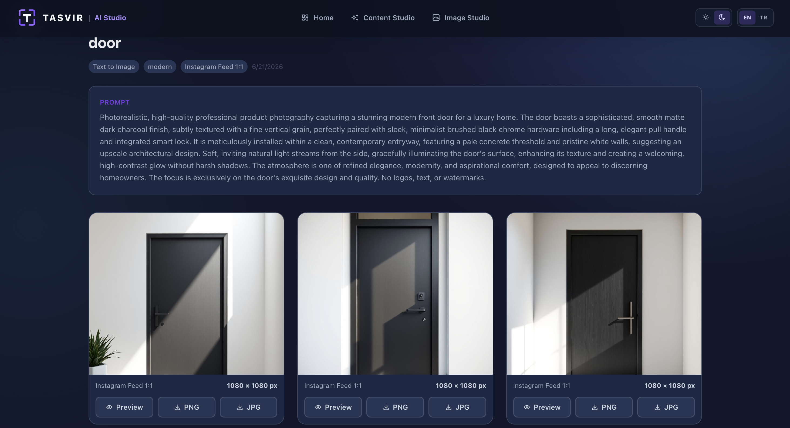

## Technology

- Frontend: React, Vite
- Backend: FastAPI, Python
- Database: MySQL
- AI Services: Gemini API, Hugging Face Inference
- Local AI: Ollama, Qwen

## Database Overview

Tasvir stores Image Studio and Content Studio data in MySQL. The ER diagram
below is an example created with DBeaver.

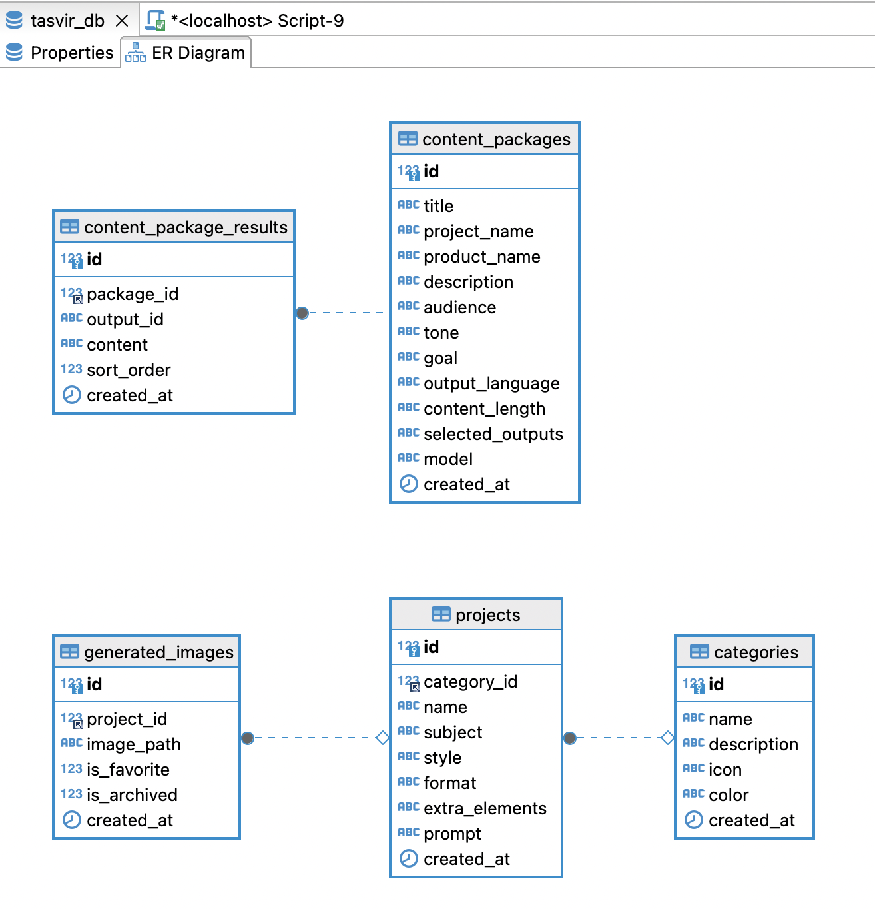

## Writing

Turkish articles I wrote about Tasvir AI Studio:

- [Tasvir AI Studio: Nasıl Ortaya Çıktı, Ne Yapıyor ve Nasıl Çalışıyor?](https://medium.com/@edakas/tasvir-ai-studio-nas%C4%B1l-ortaya-%C3%A7%C4%B1kt%C4%B1-ne-yap%C4%B1yor-ve-nas%C4%B1l-%C3%A7al%C4%B1%C5%9F%C4%B1yor-f922e629706f)
- [Tasvir AI Studio: Projenin Frontend, Backend ve AI Mimarisi](https://medium.com/@edakas/tasvir-ai-studio-projenin-frontend-backend-ve-ai-mimarisi-62d472aca085)

## Learning Resources

Tasvir can also be used as a practical learning project. These official
resources cover the technologies used in the codebase:

- [FastAPI Tutorial](https://fastapi.tiangolo.com/tutorial/)
- [Python Tutorial](https://docs.python.org/3/tutorial/)
- [React Learn](https://react.dev/learn)
- [Vite Guide](https://vite.dev/guide/)
- [MySQL Tutorial](https://dev.mysql.com/doc/refman/8.4/en/tutorial.html)
- [Gemini API Documentation](https://ai.google.dev/gemini-api/docs)
- [Hugging Face Inference Providers](https://huggingface.co/docs/inference-providers/index)

## Requirements

- Node.js `20.19+` or `22.12+`
- Python `3.12+`
- MySQL `8+`
- Gemini API key
- Hugging Face access token
- Ollama and a local Qwen model

## Quick Start

1. Complete the service setup guides:
   - [Gemini](docs/setup/gemini.md)
   - [Hugging Face](docs/setup/hugging-face.md)
   - [MySQL](docs/setup/mysql.md)
   - [Ollama and Qwen](docs/setup/ollama.md)
2. Create local environment files:

```bash
cp backend/.env.example backend/.env
cp frontend/.env.example frontend/.env
```

3. Install and run the backend:

```bash
cd backend
python3 -m venv venv
source venv/bin/activate
pip install -r requirements.txt
uvicorn app.main:app --reload
```

On Windows, activate the environment with:

```powershell
venv\Scripts\activate
```

4. In a second terminal, install and run the frontend:

```bash
cd frontend
npm install
npm run dev
```

5. Open [http://localhost:5173](http://localhost:5173).

The backend runs at [http://localhost:8000](http://localhost:8000). Database
tables are created automatically when the backend starts.

## API Documentation

FastAPI automatically provides interactive Swagger documentation while the
backend is running:

- Swagger UI: [http://127.0.0.1:8000/docs](http://127.0.0.1:8000/docs)
- OpenAPI schema: [http://127.0.0.1:8000/openapi.json](http://127.0.0.1:8000/openapi.json)

Swagger UI lists the category, project, content generation, prompt generation,
and image generation endpoints. You can inspect request and response schemas
and use **Try it out** to test API requests from the browser.

Categories and Content Studio endpoints:

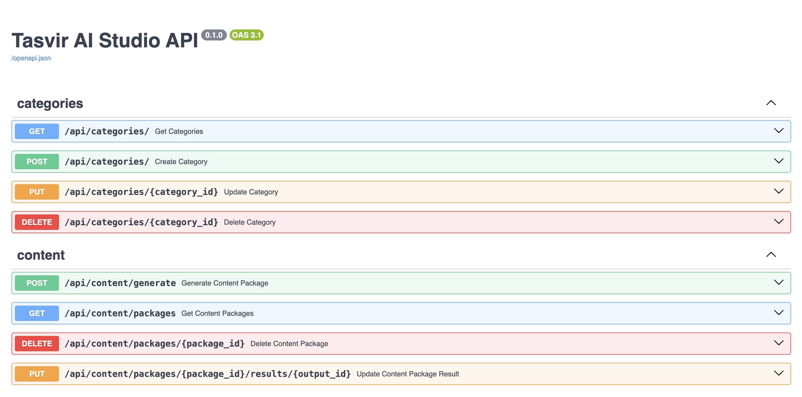

Projects and Image Studio generation endpoints:

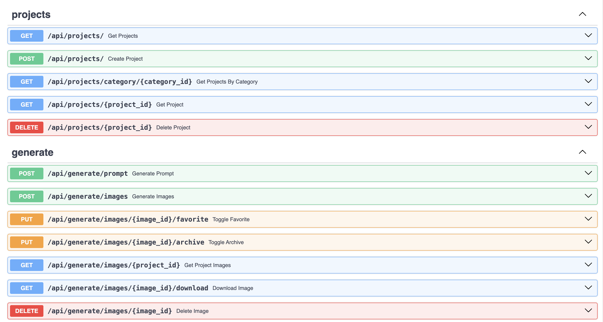

## Setup Guides

- [Gemini API key](docs/setup/gemini.md)
- [Hugging Face token](docs/setup/hugging-face.md)
- [Ollama and Qwen](docs/setup/ollama.md)
- [MySQL](docs/setup/mysql.md)
- [Troubleshooting](docs/setup/troubleshooting.md)

## Changelog

Project changes and planned work are listed in
[CHANGELOG.md](CHANGELOG.md).

## Contributing

Contribution setup, development guidelines, and pull request expectations are
available in [CONTRIBUTING.md](CONTRIBUTING.md).

## Commit Style

Commit messages follow the
[Conventional Commits](https://www.conventionalcommits.org/en/v1.0.0/)
format where possible.

## Security

Never commit `.env` files or share API keys in screenshots, issues, or commits.
Only `.env.example` files should be included in the repository.

## License

Tasvir AI Studio is open-source software licensed under the
[MIT License](LICENSE).

## Project Status

Tasvir is under active development. Image Studio is connected to its external
services, and Content Studio generates text locally through Ollama and Qwen.
Persistent content projects are still in progress.
